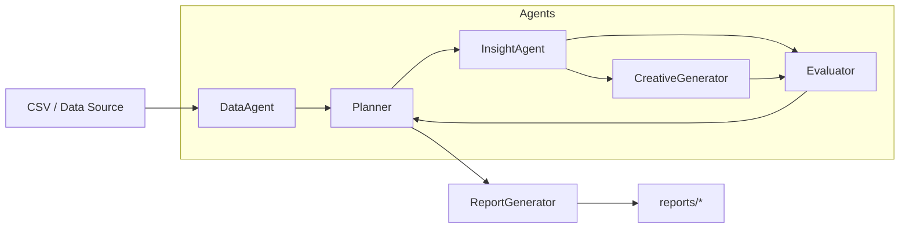

# Agent Architecture and Data Flow

This file documents the agent roles, responsibilities, and the data flow used by the Agentic Facebook Performance Analyst system.



## High-level roles

- Planner
  - Orchestrates workflows, decides which agents to run for a given user query.
  - Inputs: query string, data summary
  - Outputs: planned steps and assembled results

- DataAgent
  - Loads and preprocesses Facebook Ads data; computes metrics, trends, and anomalies.
  - Inputs: raw dataset, query context
  - Outputs: metrics, trends, anomalies

- InsightAgent
  - Generates hypotheses and explanations from processed metrics (ROAS, CTR, trends, anomalies).
  - Inputs: processed metrics/trends/anomalies
  - Outputs: structured insights, patterns, confidence scores

- CreativeGenerator
  - Translates insights into actionable creative recommendations, A/B test suggestions, and content templates.
  - Inputs: insights, campaign/audience/platform analysis
  - Outputs: structured recommendations (rationale, confidence, expected uplift, ab_tests)

- Evaluator
  - Validates and scores insights (statistical checks) and supplies confidence estimates used for prioritization.
  - Inputs: insights, raw metrics
  - Outputs: confidence_scores, validation results

- ReportGenerator (utility)
  - Renders final outputs into `reports/report.md`, `reports/insights.json`, and `reports/creatives.json`.

## Example workflow ("Analyze ROAS drop")

1. Planner receives query: "Analyze ROAS drop in last 7 days".
2. Planner runs DataAgent to compute metrics and detect anomalies.
3. Planner triggers InsightAgent to generate structured insights and patterns.
4. Planner triggers CreativeGenerator to produce structured recommendations (including rationale, confidence, expected uplift and AB test templates).
5. Evaluator validates insights and returns confidence scores.
6. ReportGenerator writes `reports/report.md`, `reports/insights.json`, and `reports/creatives.json`.

## Notes

- The repository contains a simulated workflow in `src/agents/planner.py` for local testing; in production the planner would route messages to independent agent processes/services.
- The `reports/` folder contains the deliverables: `report.md`, `insights.json`, and `creatives.json`.

```
Generated: agent_graph.md
```
